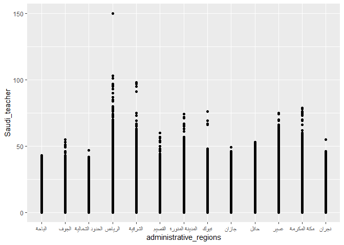
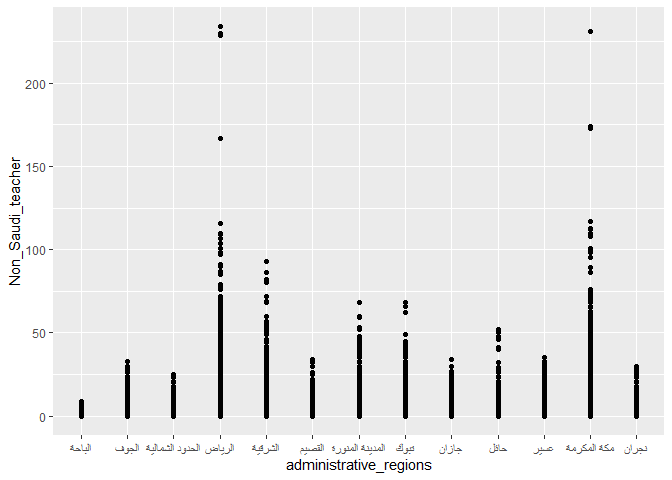
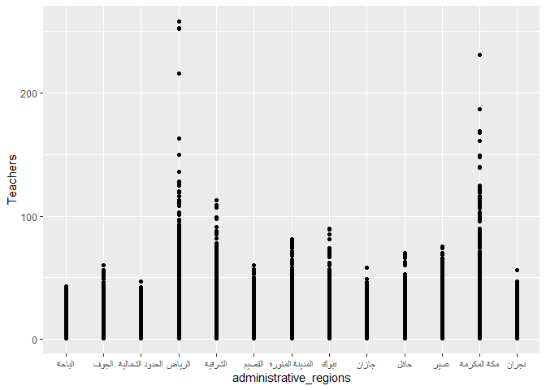
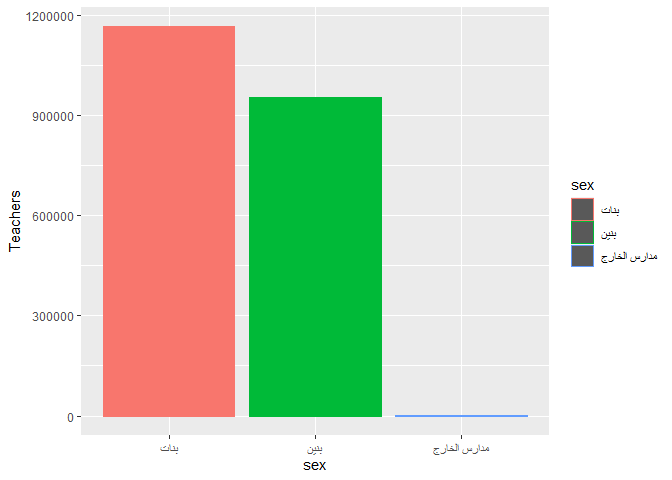

Analysis of Teachers’ Recruitment in Saudi Arabia Between 1437 and 1440
================
Musab Isah
6 March 2021

Group Number:5

Group Members’ Names (IDs):

1.  Fawzaih Nazal(2201000429) – Team Leader 2.Manar Mansour(2201002883)
    – Member 1 3.Hajar Eid(2201002337) – Member 2 4.Fadiyah
    suliman(2201001182) ,wallaa Ali(2201002583) – Member 3

## Loading Libraries

Ensure you have the `tidyverse` and `readxl` packages installed by
running the 2 lines of code below. Both the team leader and members
should run the code below in the console of rstudio.

We then need to load the data from the MS Excel (.xlsx) file, named
teachers\_data.xlsx, to the R environment for processing.

*Note: Only Team Leader should run the code below*

``` r
tdata <- read_excel("teachers_data.xlsx")
```

# Wherever you see the text ‘\#Add some code’, it means you should delete the comment and add your code for the task.

# 2 Marks will be deducted for every deadline missed.

## Task 1

``` r
tdata = rename(tdata, administrative_regions = "المنطقة الإدارية")
tdata = rename(tdata, school_Level = "المرحلة")
tdata = rename(tdata, authority = "السلطة")
tdata = rename(tdata, Office_of_Education = "مكتب التربية")
tdata = rename(tdata, sex = "الجنس")
tdata = rename(tdata, School_type = "نوع المدرسة")
tdata = rename(tdata, Type_of_education = "نوع التعليم")
tdata = rename(tdata, school_system = "نظام الدراسة")
tdata = rename(tdata, Saudi_teacher = "معلم سعودي")
tdata = rename(tdata, Non_Saudi_teacher = "معلم غير سعودي")
tdata = rename(tdata, Teachers = "معلمين جملة")
tdata = rename(tdata, the_year = "السنة")
```

Team Leader should *Knit, commit, and push changes to GitHub with an
appropriate commit message. Make sure to commit and push all changed
files so that your Git pane is cleared up afterwards.*

## Task2

Next Team Member should *Pull the changes made by Team Leader before
proceeding.*

1.  What are the different administrative\_regions (Al-Mandaqah
    Al-idariyyah) found in the data?

``` r
tdata %>% count(administrative_regions) %>% arrange(desc(n))
```

    ## # A tibble: 13 x 2
    ##    administrative_regions     n
    ##    <chr>                  <int>
    ##  1 الرياض                 31617
    ##  2 مكة المكرمة            26944
    ##  3 عسير                   15462
    ##  4 الشرقية                15034
    ##  5 المدينة المنورة        10012
    ##  6 القصيم                  9449
    ##  7 جازان                   9229
    ##  8 حائل                    5302
    ##  9 تبوك                    4722
    ## 10 الباحة                  4220
    ## 11 الجوف                   3442
    ## 12 نجران                   2933
    ## 13 الحدود الشمالية         2072

Comments about your answer:the biggest regions -&gt;{riyadh: 31617 ,
makkah : 26944 }

and the smallest-&gt; {alhudood alshmalya : 2072 , najran : 2933}.

2.  Based on your knowledge of the administrative regions in Saudi
    Arabia, is there any region that has not recruited any teacher
    during the period under review (1437 - 1440 Hijri)? List the Saudi
    regions shown in the data.

``` r
tdata %>% filter(the_year>=1437 ,the_year<=1440, Teachers==0)%>% count(administrative_regions)
```

    ## # A tibble: 0 x 2
    ## # ... with 2 variables: administrative_regions <chr>, n <int>

``` r
tdata %>% filter(the_year>=1437 ,the_year<=1440, Saudi_teacher==0)%>% count(administrative_regions)%>%arrange(desc(n))
```

    ## # A tibble: 13 x 2
    ##    administrative_regions     n
    ##    <chr>                  <int>
    ##  1 الرياض                   652
    ##  2 مكة المكرمة              509
    ##  3 الشرقية                  289
    ##  4 المدينة المنورة          100
    ##  5 عسير                      51
    ##  6 الجوف                     32
    ##  7 حائل                      31
    ##  8 تبوك                      29
    ##  9 القصيم                    24
    ## 10 نجران                     22
    ## 11 جازان                     17
    ## 12 الحدود الشمالية           15
    ## 13 الباحة                     1

``` r
tdata %>% filter(the_year>=1437 ,the_year<=1440, Non_Saudi_teacher==0)%>% count(administrative_regions)%>%arrange(desc(n))
```

    ## # A tibble: 13 x 2
    ##    administrative_regions     n
    ##    <chr>                  <int>
    ##  1 الرياض                 25271
    ##  2 مكة المكرمة            22492
    ##  3 عسير                   14773
    ##  4 الشرقية                12160
    ##  5 المدينة المنورة         9220
    ##  6 القصيم                  9054
    ##  7 جازان                   8766
    ##  8 حائل                    5014
    ##  9 تبوك                    4211
    ## 10 الباحة                  4165
    ## 11 الجوف                   2852
    ## 12 نجران                   2661
    ## 13 الحدود الشمالية         1826

Comments about your answer:The year (1437 to 1440), one non-Saudi and
Saudis teacher was appointed by the administrative regions and most
regions, at least one teacher was appointed in Riyadh.

The Team Member should *Knit, commit, and push changes to GitHub with an
appropriate commit message.*

## Task3

The Next Team Member should *Pull the changes made by Member 1 before
proceeding.*

1.  Saudi Arabian education is divided into different stages/levels
    (Al-Marhala), list the different levels showed in the data in
    descDEADLINE: ENDing order of frequency. (4 points)

``` r
count (tdata, "school_Level")
```

    ## # A tibble: 1 x 2
    ##   `"school_Level"`      n
    ##   <chr>             <int>
    ## 1 school_Level     140438

``` r
tdata%>%arrange (desc(school_Level))
```

    ## # A tibble: 140,438 x 13
    ##       id administrative_reg~ school_Level authority Office_of_Education    sex  
    ##    <dbl> <chr>               <chr>        <chr>     <chr>                  <chr>
    ##  1    18 مكة المكرمة         رياض أطفال   حكومي     مكتب التربية والتعليم~ بنات 
    ##  2    23 عسير                رياض أطفال   حكومي     ابها                   بنات 
    ##  3    63 جازان               رياض أطفال   حكومي     مكتب التربية والتعليم~ بنات 
    ##  4    66 عسير                رياض أطفال   حكومي     بارق                   بنات 
    ##  5    79 نجران               رياض أطفال   حكومي     نجران                  بنات 
    ##  6    86 الجوف               رياض أطفال   حكومي     طبرجل                  بنات 
    ##  7    91 الشرقية             رياض أطفال   حكومي     إدارة التربية والتعلي~ بنات 
    ##  8    95 مكة المكرمة         رياض أطفال   حكومي     مكتب اضم               بنات 
    ##  9    96 جازان               رياض أطفال   حكومي     مكتب التربية والتعليم~ بنات 
    ## 10    97 حائل                رياض أطفال   أهلي      موقق                   بنات 
    ## # ... with 140,428 more rows, and 7 more variables: School_type <chr>,
    ## #   Type_of_education <chr>, school_system <chr>, Saudi_teacher <dbl>,
    ## #   Non_Saudi_teacher <dbl>, Teachers <dbl>, the_year <dbl>

Comments about your answer:that we have 140438 (int)(n) of
school\_level.

2.  Which level recruit the most teachers? (4 points)

``` r
tdata%>%count (school_Level)%>%arrange (desc(n))
```

    ## # A tibble: 6 x 2
    ##   school_Level           n
    ##   <chr>              <int>
    ## 1 المرحلة الابتدائية 58471
    ## 2 المرحلة المتوسطة   34290
    ## 3 المرحلة الثانوية   23660
    ## 4 رياض أطفال         14302
    ## 5 التربية الخاصة      9105
    ## 6 التعليم المستمر      610

Comments about your answer:The largest level in recrufitment is the
primary schools and the lowest level is the continue learning, so we we
should educate and qualify specialized teachers at the primary stage
because it is the most important stage in terms of employment
requirements and also the most important In students’ lives

The Team Member should *Knit, commit, and push changes to GitHub with an
appropriate commit message.*

The Next Team member should *Pull the changes made by Team Leader before
proceeding.*

3.  Plot the graph of region versus number of **Saudi** teachers
    recruited over the period. (4 points)

``` r
ggplot (data=tdata, aes (x=administrative_regions, y= Saudi_teacher)) + geom_point (stat="identity")
```

<!-- -->

Comments about your answer: The most number of Saudi teachers has been
employed in (riyadh) and The fewest number of Saudi teachers have been
employed in northern borders

4.  Plot the graph of region versus number of **Non-Saudi** teachers
    recruited over the period. (4 points)

``` r
ggplot (data=tdata, aes (x=administrative_regions, y= Non_Saudi_teacher)) + geom_point (stat="identity")
```

<!-- -->

Comments about your answer: The most number of non Saudi teachers has
been employed in ( riyadا ) and The fewest number of saudi teachers have
been employed in Albahaa

5.  Plot the graph of region versus number of **all teachers** recruited
    over the period. (4 points)

``` r
ggplot (data=tdata, aes (x=administrative_regions, y= Teachers)) + geom_point (stat="identity")
```

<!-- -->

Comments about your answer: The most number of non or Saudi teachers has
been employed in (riyad) and The fewest number of saudi teachers have
been employed in northern borders

The Team Member should *Knit, commit, and push changes to GitHub with an
appropriate commit message.*

## Task 4

The Next Team member should *Pull the changes made previously before
proceeding.*

1.  How many boys and how many girls schools are listed in the data? (4
    points)

``` r
tdata%>%count(sex)
```

    ## # A tibble: 3 x 2
    ##   sex              n
    ##   <chr>        <int>
    ## 1 بنات         77462
    ## 2 بنين         62766
    ## 3 مدارس الخارج   210

Comments about your answer: the number of girls schools &gt;&gt; (77462)
is more then the number of boys schools &gt;&gt; (62766)

2.  Between boys and girls schools, which recruit more teachers? (4
    points)

``` r
tdata%>%group_by(sex)%>%summarise_at(vars(Teachers),list(sum=sum))
```

    ## # A tibble: 3 x 2
    ##   sex              sum
    ##   <chr>          <dbl>
    ## 1 بنات         1166895
    ## 2 بنين          954028
    ## 3 مدارس الخارج    2239

Comments about your answer: boys\_schools\_teachers = (954028)
girls\_schools\_teachers = (1166895) more teachers are employed in girls
’schools than boys’ schools

3.  What is the correlation between recruitment at boys schools and
    recruitment of girls schools? (4 points)

``` r
#Add some code
```

Comments about your answer:

The Team Member should *Knit, commit, and push changes to GitHub with an
appropriate commit message.*

## Task 5

The Next Team member should *Pull the changes made previously before
proceeding.*

1.  How many teachers are recruited each year, 1437, 1438, 1439, and
    1440?

``` r
#Add some code
```

Comments about your answer:

2.  Which region recruited the most teachers in each of the years under
    review? (4 points)

``` r
#Add some code
```

Comments about your answer:

3.  Plot the graph of number of teachers recruited vs the number of
    schools in an administrative region? What type or relationship exist
    between the two variables? (4 points)

``` r
ggplot(data=tdata, aes(x=sex, y= Teachers , color = sex)) +                              geom_bar(stat="identity")
```

<!-- -->

Comments about your answer: the number of female teachers working in
girls ’schools exceeds the number of teachers working in boys’ schools.
therefore, emphasis must be placed on training and educating female
teachers at higher rates to prepare them to work in girls ’schools, and
employing more teachers working in boys’ schools

The Team Member should *Knit, commit, and push changes to GitHub with an
appropriate commit message.*

## If you are here, then congratulations!! You have completed the DSC 200 course project.
